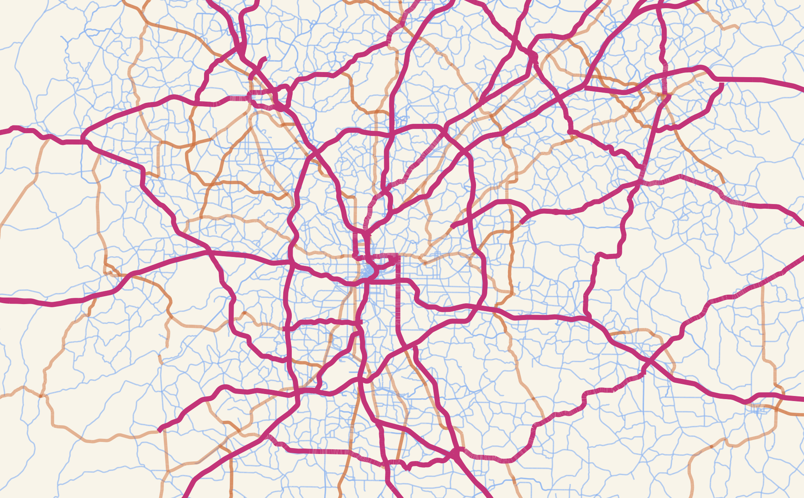

# Highways Are Barriers To Urban Social Connections

This is a repository *under construction* for the working paper **Highways Are Barriers To Urban Social Connections** (link to preprint will follow) by [Luca Maria Aiello](mailto:luai@itu.dk), [Sándor Juhász](sandorjuhasz@ymail.com), [Anastassia Vybornova](mailto:anvy@itu.dk), [Michael Szell](mailto:misz@itu.dk), and [Eszter Bokányi](mailto:e.bokanyi@uva.nl). **Get in touch** by klicking on our names.

## Repository contents

* `code` Run notebooks in indicated order. All comments within the notebooks.
* `data` All publicly available data
* `plots` All plots used for presentations and paper
* `presentations` Presentations and posters of the project

